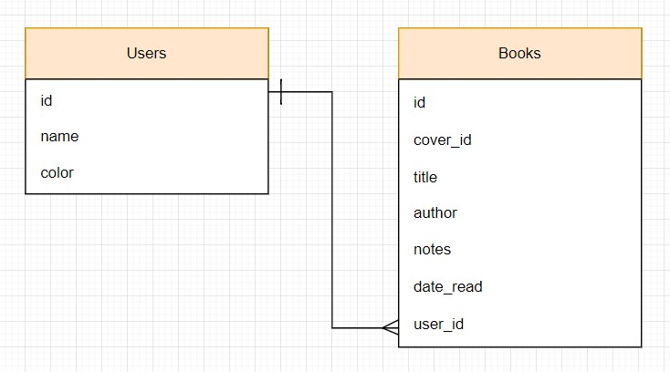
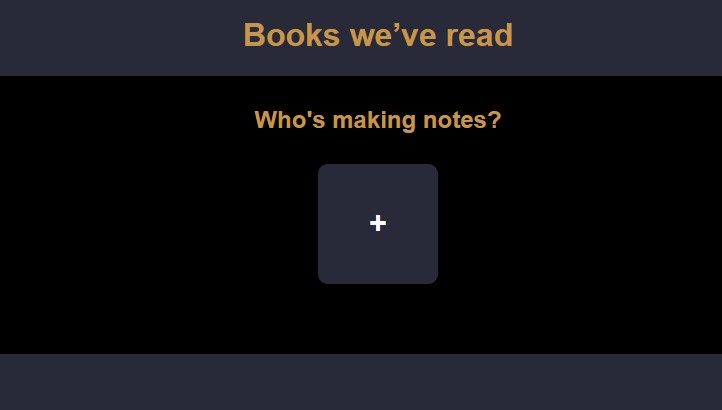
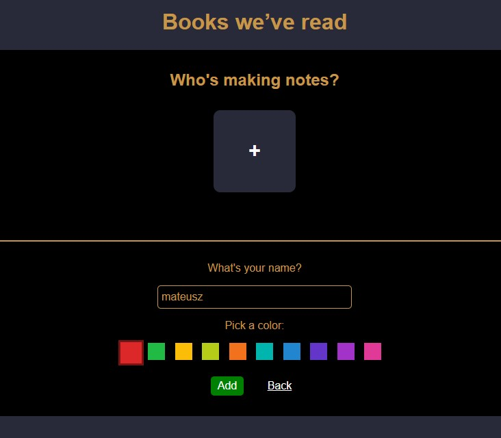
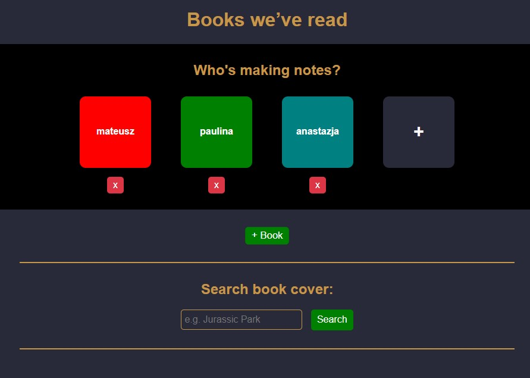
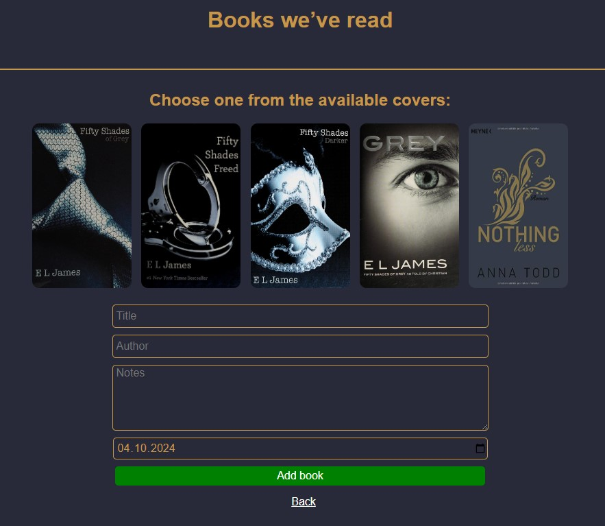
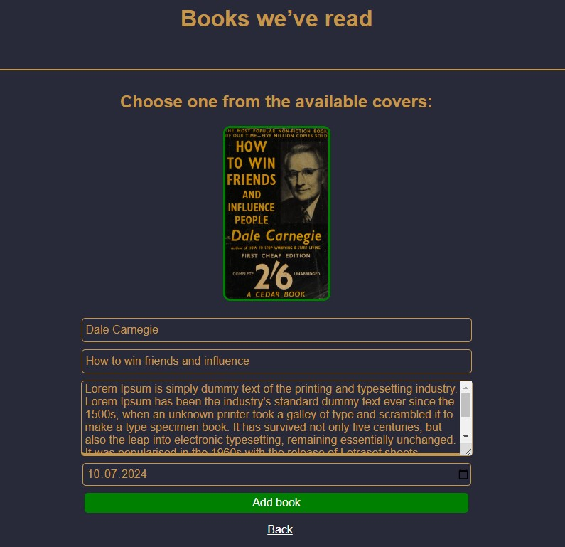
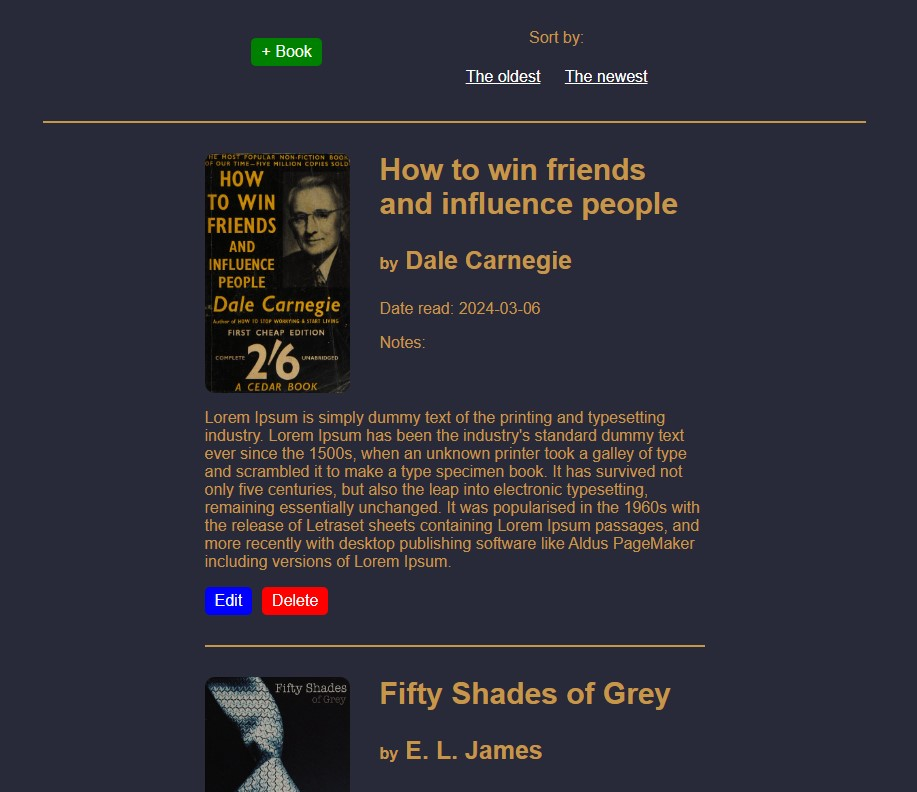
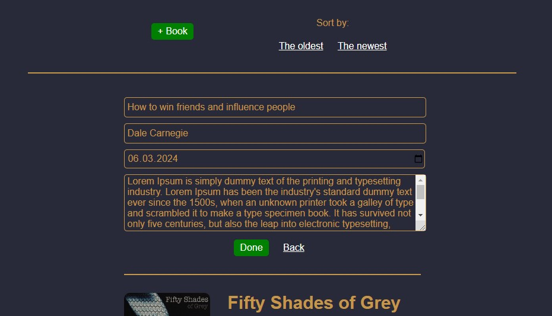

# Capstone-Project-4_Book-Notes

Project idea:\
"I read a lot of books but after I finish reading them I often don't remember all the most salient parts of the book. So I started taking notes. This capstone project is built on this idea. The books are sortable by recency."\
\
I present a family Book Notes to make notes about readed books. An application is designed for five members (users), members can be added and removed at any time. In addition two members can have the same name, cannot have the same colors.\
An application does not require authentication.

## Table of contents

- [Overview](#overview)
  - [How to start](#how-to-start)
  - [Database design](#database-design)
  - [Screenshot](#screenshot)
- [My process](#my-process)
  - [Built with](#built-with)
  - [Useful resources](#useful-resources)

## Overview

It's a Single Page Application using the Express/Node.js platform, with Axios HTTP client, that integrates a public API - in my case public OpenLibrary API.
The app interact with the chosen API and fetch book covers.\
\
User data are persist using a PostgreSQL database.\
An application used CRUD methods to manipulate data in the database and simple data validation applied.\
Error handling - console log (for developers) and user-relevant errors.

### How to start

- download the Postgres Installer and create a new pgAdmin account,
- create a new database called "book_notes" in pgAdmin,
- run the queries.sql code in pgAdmin Query Tool to create required tables,

- use e.g. Visual Studio Code,
- provide a pgAdmin password in index.js file,
- run command to install dependencies -> npm i,
- run command to install nodemon globally on the PC -> npm i -g nodemon,
- run command -> nodemon index.js,
- website is running on localhost, so open a web browser and run http://localhost:3000/

### Database schema

### Screenshot

- First opening:

- Add new user to the family:

- Search book cover (public OpenLibrary API):

- New book form with searched covers:

- Selected cover from the available covers with fields completed by the user:

- Books list:

- Edit book information:

## My process

### Built with

- Node.js project using Express.js,
- include Axios for making HTTP requests to the API and handle responses,
- include EJS for templating,
- include pg for working with localhost PostgreSQL database,
- frontend - HTML, vanilla CSS and vanilla JS.

### Useful resources

- [Web Development Bootcamp](https://www.udemy.com/course/the-complete-web-development-bootcamp/?couponCode=KEEPLEARNING)
- [Express.js documentation](https://expressjs.com/)
- [Node.js documentation](https://nodejs.org/docs/latest/api/)
- [Axios documentation](https://axios-http.com/docs/intro)
- [public OpenLibrary API](https://openlibrary.org/)
- [Postgres documentation](https://www.postgresql.org/)
